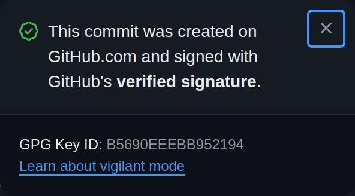

# `@s0/ghcommit`

[](https://www.npmjs.com/package/@s0/ghcommit)

NPM / TypeScript package to commit changes GitHub repositories using the GraphQL API.

## Why?

If you or your organisation has strict requirements
around requiring signed commits (i.e. via Branch Protection or Repo Rulesets), then this can make integrating CI workflows or applications that are designed to make changes to your repos quite difficult. This is because you will need to manage your own GPG keys, assign them to machine accounts (which also means it doesn't work with GitHub Apps), and securely manage and rotate them.

Instead of doing this, if you use the GitHub API to make changes to files (such as what happens when making changes to files directly in the web UI), then GitHub's internal GPG key is used, and commits are all signed and associated with the user of the access token that was used.

(And this also works with GitHub Apps too, including the GitHub Actions app).



This library has primarily been designed for use in custom Node GitHub Actions, but can be used in any Node.js or JavaScript project that needs to directly modify files in GitHub repositories.

## Usage

### Installation

Install using your favourite package manager:

```
pnpm install @s0/ghcommit
```

### Usage in github actions

All functions in this library that interact with the GitHub API require an octokit client that can execute GraphQL. If you are writing code that is designed to be run from within a GitHub Action, this can be done using the `@actions.github` library:

```ts
import { getOctokit } from "@actions/github";

const octokit = getOctokit(process.env.GITHUB_TOKEN);
```

### Importing specific modules

To allow for you to produce smaller bundle sizes, the functionality exposed in this package is grouped into specific modules that only import the packages required for their use. We recommend that you import from the specific modules rather than the root of the package.

## API

All the functions below accept a single object as its argument, and share the following base arguments:

<!-- TODO: point to some generated docs instead of including a code snippet -->


```ts
{
  octokit: GitHubClient;
  owner: string;
  repository: string;
  branch: string;
  /**
   * Push the commit even if the branch exists and does not match what was
   * specified as the base.
   */
  force?: boolean;
  /**
   * The commit message
   */
  message: CommitMessage;
  log?: Logger;
}
```

### `commitChangesFromRepo`

This function will take an existing repository on your filesystem (defaulting to the current working directory). This function is good to use if you're usually working within the context of a git repository, such as after running `@actions/checkout` in github actions.

In addition to `CommitFilesBasedArgs`, this function has the following arguments:

```ts
{
  /**
   * The root of the repository.
   *
   * @default process.cwd()
   */
  repoDirectory?: string;
}
```

Example:

```ts
import { getOctokit } from "@actions/github";
import { commitChangesFromRepo } from '@s0/ghcommit/git';

const octokit = getOctokit(process.env.GITHUB_TOKEN);

// Commit & push the files from the current directory
// e.g. if you're just using @ations/checkout
await commitChangesFromRepo({
  octokit,
  owner: 'my-org',
  repository: 'my-repo',
  branch: 'new-branch-to-create',
  message: {
    headline: '[chore] do something'
  }
});

// Commit & push the files from ta specific directory
// where we've cloned a repo, and made changes to files
await commitChangesFromRepo({
  octokit,
  owner: 'my-org',
  repository: 'my-repo',
  branch: 'another-new-branch-to-create',
  message: {
    headline: '[chore] do something else'
  },
  repoDirectory: '/tmp/some-repo'
});
```

### `commitFilesFromDirectory`

This function will add or delete specific files from a repository's branch based on files found on the local filesystem. This is good to use when there are specific files that need to be updated on a branch, or if many changes may have been made locally, but only some files need to be pushed.

In addition to `CommitFilesBasedArgs`, this function has the following arguments:

```ts
{
  /**
   * The directory to consider the root of the repository when calculating
   * file paths
   */
  workingDirectory?: string;
  /**
   * The file paths, relative to {@link workingDirectory},
   * to add or delete from the branch on GitHub.
   */
  fileChanges: {
    /** File paths, relative to {@link workingDirectory}, to remove from the repo. */
    additions?: string[];
    /** File paths, relative to the repository root, to remove from the repo. */
    deletions?: string[];
  };
}
```

Example:

```ts
import { getOctokit } from "@actions/github";
import { commitFilesFromDirectory } from '@s0/ghcommit/fs';

const octokit = getOctokit(process.env.GITHUB_TOKEN);

// Commit the changes to package.json and package-lock.json
await commitFilesFromDirectory({
  octokit,
  owner: 'my-org',
  repository: 'my-repo',
  branch: 'new-branch-to-create',
  message: {
    headline: '[chore] do something'
  },
  base: {
    branch: "main",
  },
  workingDirectory: 'foo/bar',
  fileChanges: {
    additions: ['package-lock.json', 'package.json']
  }
});
```


### Pushing locally changed files

If you are working with a locally cloned GitHub repo, and want to push the changes to the files you have made locally (for example when running )

## Other Tools / Alternatives

- [planetscale/ghcommit](https://github.com/planetscale/ghcommit) - Go library for committing to GitHub using graphql
- [planetscale/ghcommit-action](https://github.com/planetscale/ghcommit-action) - GitHub Action to detect file changes and commit using the above library
